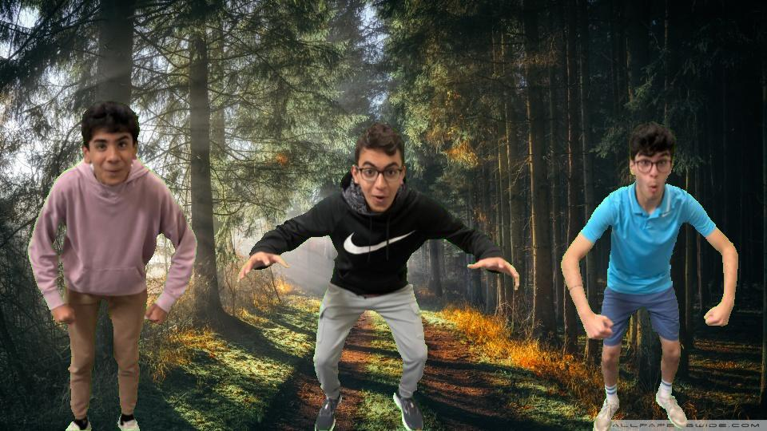
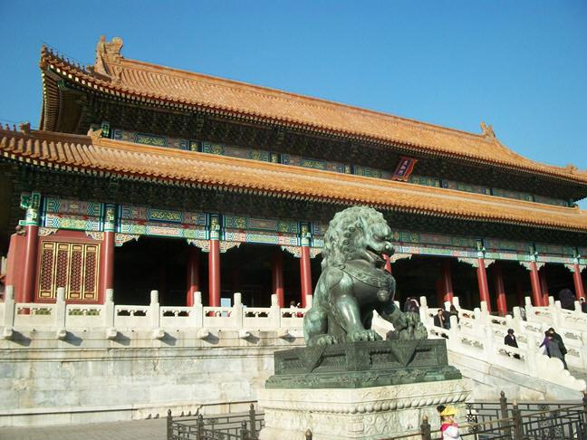
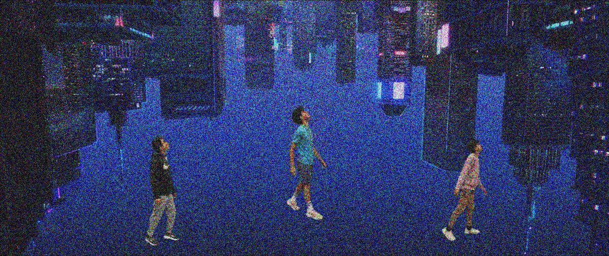

# PictureLab
Methods by Milav and Runbier

All PictureLab methods are in `PixLab/src/PictureLab.java`

## Methods
* [X] Chromakey
* [X] Stegonagraphy
* [X] Random Color Grain
* [X] Color Masking

## Writeups
### Chromakey
The chromakey method greenscreens two images. This is a similar technique to that used in video production. Our method takes two images as input: one background and one foreground. It replaces all green pixels in the foreground image (the greenscreen) with the corresponding pixels from the background image. The method takes two filenames as input: one for the background image and one for the foreground image. In specific, the `colorDistance` condition ensures only pixels close to green `(0,255,0)` are replaced. This threshold should be changed based on the input images for best results.

### Stegonagraphy
Encode: Our encode method takes a background image and changes the blue amount in every pixel to an odd number. However, if the corresponding pixel in msg.jpg is black (meaning a part of the message), then the corresponding pixel in the encoded background image has an even blue value. This means that only the pixels that correspond to the message have an even blue value.
Decode: The decoding method takes an encoded image (from the encode method) as input and finds the hidden message. To do this, the method sets the color to every pixel where the blue value is odd to black, and sets the pixels where blue is even to red. This means the messgae is visible in red when displayed.

### Colorful Noise
This method takes in a String file, int grain, and boolean greenscreen. It iterates through each pixel with a nested for loop and changes the red, green and blue values randomly within a certain range specified by the grain parameter. This creates a “noisy” effect on the image that resembles a glitch. The greenscreen parameter is used when using this method with a greenscreen, which only pixelates non-green pixels.

### Color Masking
The color mask method takes 3 parameters: String file, int distance, and Color color. We iterate through the image with a nested for loop and analyze each pixel to make sure it is within the range of the specified color using the distance parameter. We then iterate over every pixel. If the pixel isn’t within the range, we set the color to black, and if it is in range, we set it to white. The result is an image that turns the desired color white and everything else black, so you can see every occurence of the color you specified in the picture. This is known as color masking.

